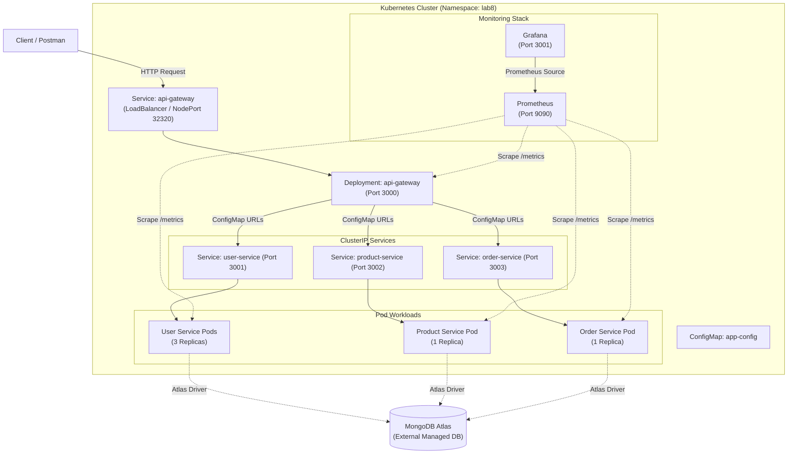

# Lab 8 — Kubernetes, Basic CI/CD & Monitoring

---

## 1. Executive Summary

This laboratory extends the microservices application built in **Lab 7** by migrating it to a cloud-native DevOps environment. The system integrates:
* **Orchestration**: Kubernetes manifests for deployments, services, namespaces (`lab8`), and environment configurations (`ConfigMap`).
* **Resilience**: Replica management, horizontal pod scaling (`user-service`), and self-healing pod recovery.
* **CI/CD**: GitHub Actions workflow (`.github/workflows/ci.yml`) automating dependency installation, testing, and container builds.
* **Observability**: Prometheus metric scraping (`port 9090`) and Grafana visualization dashboards (`port 3001`).

---

## 2. System Architecture



---

## 3. Kubernetes Environment Specifications

* **Cluster Provider**: KinD (Kubernetes in Docker)
* **Cluster Context**: `kind-lab8-cluster`
* **Control Plane Node**: `lab8-cluster-control-plane` (Status: `Ready`, Version: `v1.31.0`)
* **Namespace**: `lab8`

### Cluster Diagnostics & Context Commands
```powershell
kubectl config current-context
kubectl get nodes
kubectl get namespaces
```

---

## 4. Manifest Directory & Resource Maps (`k8s/`)

| File | API Version & Kind | Resource Name | Purpose |
| :--- | :--- | :--- | :--- |
| `configmap.yaml` | `v1 / ConfigMap` | `app-config` | Externalized non-sensitive service URLs & ports |
| `gateway-deployment.yaml` | `apps/v1 / Deployment` | `api-gateway` | Manages 1 replica of the API Gateway proxy container |
| `gateway-service.yaml` | `v1 / Service` | `api-gateway` | LoadBalancer service exposing port 3000 (NodePort 32320) |
| `user-deployment.yaml` | `apps/v1 / Deployment` | `user-service` | Manages 3 scaled replicas of User Service |
| `user-service.yaml` | `v1 / Service` | `user-service` | ClusterIP service exposing port 3001 |
| `product-deployment.yaml` | `apps/v1 / Deployment` | `product-service` | Manages 1 replica of Product Service |
| `product-service.yaml` | `v1 / Service` | `product-service` | ClusterIP service exposing port 3002 |
| `order-deployment.yaml` | `apps/v1 / Deployment` | `order-service` | Manages 1 replica of Order Service |
| `order-service.yaml` | `v1 / Service` | `order-service` | ClusterIP service exposing port 3003 |

---

## 5. Application Deployment & Operations

### 5.1 Apply Manifests
```powershell
kubectl apply -f k8s/ -n lab8
kubectl get deployments,pods,services -n lab8
```

### 5.2 API Gateway Verification
Port forward API Gateway to port 3000:
```powershell
kubectl port-forward -n lab8 svc/api-gateway 3000:3000
```
Endpoints:
* `GET http://localhost:3000/users`
* `GET http://localhost:3000/products`
* `GET http://localhost:3000/orders`

### 5.3 Horizontal Pod Scaling
Scale `user-service` to 3 replicas:
```powershell
kubectl scale deployment user-service --replicas=3 -n lab8
kubectl get pods -n lab8
```

### 5.4 Self-Healing Recovery
Demonstrate self-healing by deleting a pod:
```powershell
kubectl delete pod <user-service-pod-name> -n lab8
kubectl get pods -n lab8
```

---

## 6. GitHub Actions CI Pipeline (`.github/workflows/ci.yml`)

The CI pipeline runs on `push` and `pull_request` to `main`/`master` branches:
1. **Checkout**: Fetches repository code.
2. **Environment Setup**: Configures Node.js 18.
3. **Dependency Resolution**: Runs `npm install` across microservice modules.
4. **Containerization**: Builds Docker images tagged with `github.sha`.

---

## 7. Monitoring Stack (Prometheus & Grafana)

* **Prometheus Access**: `kubectl port-forward -n lab8 svc/prometheus 9090:9090` (`http://localhost:9090`)
* **Grafana Access**: `kubectl port-forward -n lab8 svc/grafana 3001:3000` (`http://localhost:3001`)

### Target Health Matrix
| Target Service | Endpoint | Scrape Port | Status |
| :--- | :--- | :--- | :--- |
| API Gateway | `api-gateway:3000` | 3000 | `UP` |
| User Service | `user-service:3001` | 3001 | `UP` |
| Product Service | `product-service:3002` | 3002 | `UP` |
| Order Service | `order-service:3003` | 3003 | `UP` |

---

## 8. Evidence & Deliverables Checklist (13 Screenshots)

| Screenshot ID | Topic | Content / Command |
| :---: | :--- | :--- |
| **Screenshot 1** | Lab 7 Baseline | `GET /users` Postman request before k8s migration |
| **Screenshot 2** | k8s Environment | `kubectl config current-context` & `kubectl get nodes` |
| **Screenshot 3** | Manifest Files | Directory listing of `k8s/` folder showing 9 YAML files |
| **Screenshot 4** | Deployments | `kubectl get deployments,pods,services -n lab8` |
| **Screenshot 5** | Gateway Test | Postman request through Kubernetes API Gateway |
| **Screenshot 6** | Pod Scaling | `user-service` deployment scaled to 3 replicas |
| **Screenshot 7** | Self-Healing | Terminal showing deleted pod and replacement pod starting |
| **Screenshot 8** | Troubleshooting | `kubectl describe pod` or `kubectl logs` output |
| **Screenshot 9** | GitHub Actions | Successful CI workflow execution in GitHub Actions UI |
| **Screenshot 10** | Prometheus Targets | Prometheus targets UI page (`:9090`) showing `UP` states |
| **Screenshot 11** | Grafana Dashboard | Grafana dashboard UI page (`:3001`) with metrics panels |
| **Screenshot 12** | Traffic Monitoring | Grafana metric changes after API traffic generation |
| **Screenshot 13** | Architecture Overview | Complete system architecture diagram |
